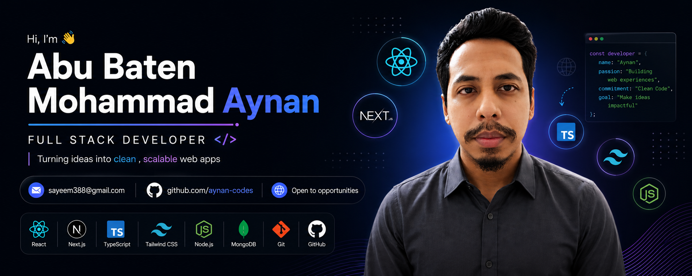

  

<h1 align="center">👋 Hi, I'm Abu Baten Mohammad Aynan</h1>

<h3 align="center">💻 Full Stack Web Developer</h3>

  Passionate about building modern, scalable and user-friendly web applications.

---

## 👨‍💻 About Me

- 💻 I'm a passionate **frontend Web Developer**.
- 🚀 Currently learning and improving my skills in **JavaScript, TypeScript, Node.js, Express.js & MongoDB**.
- 🧠 I enjoy solving problems and writing clean, efficient and maintainable code.
- 🌱 Always learning new technologies and improving my development skills.
- 🎯 My goal is to become a **Professional Full-Stack Web Developer**.
- ⚡ I love turning ideas into real-world applications.

---

## 🛠️ Technologies & Tools

- **Languages:** JavaScript, TypeScript
- **Backend:** Node.js, Express.js
- **Database:** MongoDB
- **Frontend:** HTML, CSS, Tailwind CSS
- **Tools:** Git, GitHub, VS Code

---

## 📚 Currently Learning

🚀 Advanced JavaScript  
🚀 TypeScript  
🚀 Node.js & Express.js  
🚀 MongoDB  
🚀 Full-Stack Web Development  

---

## 🎯 My Goal

> To become a skilled Full-Stack Web Developer and build scalable, impactful web applications.

---

## 🤝 Connect With Me

  <a href="YOUR_FACEBOOK_LINK">Facebook</a> •
  <a href="YOUR_LINKEDIN_LINK">LinkedIn</a> •
  <a href="YOUR_PORTFOLIO_LINK">Portfolio</a>

### 🚀 TECHNOLOGY STACK:

### 💻 Languages:

  
  
  
  
  

### 🎨 CSS Frameworks & Libraries:

  
  

### ⚙️ JavaScript Frameworks & Libraries:

  
  
  
  
  

### 🗄️ Database & Model:

  
  
  

### 🚀 Deployment Platform:

  
  
  

### 🎨 Design & Graphics:

  
  

### 🛠️ Tools & Technologies:

  
  
  
  
  
  

